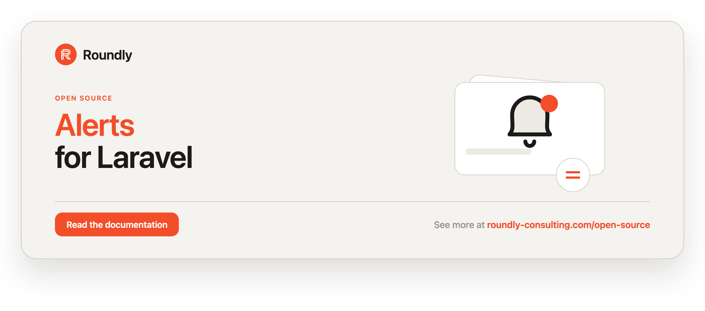

<!-- roundly-hero:start -->
<p align="center">
  <a href="https://roundly-consulting.com/open-source/docs/alerts-for-laravel?utm_source=github&utm_medium=readme&utm_campaign=open-source&utm_content=alerts-for-laravel">
    
  </a>
</p>
<!-- roundly-hero:end -->

<!-- roundly-badges:start -->
<p align="center">
  <a href="https://packagist.org/packages/roundly-consulting/alerts-for-laravel"></a>
  <a href="https://github.com/roundly-consulting/alerts-for-laravel/actions/workflows/run-tests.yml"></a>
  <a href="https://github.com/roundly-consulting/alerts-for-laravel/actions/workflows/fix-php-code-style-issues.yml"></a>
  <a href="https://donate.stripe.com/dRmeVe8FX5PF1Qd9pXcEw00"></a>
  <a href="https://www.patreon.com/cw/roundly"></a>
  <a href="https://roundly-consulting.com/support-us?utm_source=github&utm_medium=readme&utm_campaign=open-source&utm_content=alerts-for-laravel#crypto"></a>
</p>
<!-- roundly-badges:end -->

# Alerts for Laravel

Schedule recurring health checks against any notifiable model. When a check fails, the package
opens an alert and sends throttled notifications. When it recovers, the package closes the alert and
dispatches a `HealthCheckRecovered` event (no notification is sent on recovery — see [Events](#events)
to send one).

The package gives you three building blocks:

- **`Check`** — a class you write (e.g. `DiskUsageCheck`, `PingWebsiteCheck`) that performs
  a check and returns a `CheckResult`.
- **`HealthCheck`** — the database record that schedules a `Check` to run at a given cron
  frequency for a specific notifiable owner.
- **`Alert`** — the record created when a health check fails, capturing the `triggered_at`
  and `recovered_at` timestamps plus any meta data.

A single Artisan command, scheduled to run every minute, dispatches a queued job for every
health check that is due.

## Requirements

- PHP 8.4
- Laravel 12 or 13

## Installation

```bash
composer require roundly-consulting/alerts-for-laravel
```

Publish and run the migrations:

```bash
php artisan vendor:publish --tag="alerts-migrations"
php artisan migrate
```

The migrations are **publish-only** — the package never registers them with the migrator, so
`php artisan migrate` runs exactly the files you published, in the order they were published.
Publishing again is idempotent: it overwrites in place rather than dropping a second copy.

Optionally publish the config file or translations:

```bash
php artisan vendor:publish --tag="alerts-config"
php artisan vendor:publish --tag="alerts-translations"
```

## Configuration

The published `config/alerts.php` lets you swap the models and job the package uses, register
checks globally, control scheduling, and configure the optional status endpoint:

```php
<?php

return [
    'health-check' => \RoundlyConsulting\Alerts\HealthCheck::class,
    'alert' => \RoundlyConsulting\Alerts\Alert::class,
    'job' => \RoundlyConsulting\Alerts\Jobs\HealthCheckJob::class,

    // Key type of the polymorphic notifiable columns: "bigint", "uuid" or "ulid".
    // Set it BEFORE running the migrations when your notifiables use UUID/ULID keys.
    'key_type' => env('ALERTS_KEY_TYPE', 'bigint'),

    // Check classes registered globally on boot.
    'checks' => [
        // \RoundlyConsulting\Alerts\Checks\DatabaseCheck::class,
    ],

    // Auto-register the perform command on the scheduler.
    'schedule' => [
        'enabled' => env('ALERTS_SCHEDULE', true),
        'frequency' => env('ALERTS_SCHEDULE_FREQUENCY', 'everyMinute'),
    ],

    // Opt-in JSON status endpoint registered via Health::routes().
    'route' => [
        'uri' => env('ALERTS_ROUTE_URI', 'health'),
        'name' => 'alerts.health',
    ],

    // Master switch for maintenance-window muting + the silence model.
    'silence' => env('ALERTS_SILENCE', true),
    'silence-model' => \RoundlyConsulting\Alerts\AlertSilence::class,

    // Run history + latency tracking, retention, and the run model.
    'history' => [
        'enabled' => env('ALERTS_HISTORY', true),
        'retention_days' => (int) env('ALERTS_HISTORY_RETENTION', 30),
        'model' => \RoundlyConsulting\Alerts\HealthCheckRun::class,
    ],

    // Optional global default escalation policy (data-only).
    'escalation' => [
        // 1 => 'owner', 3 => 'team', 5 => 'oncall',
    ],
];
```

| Key | Type | Default | Env | Purpose |
|---|---|---|---|---|
| `health-check` | `class-string` | `RoundlyConsulting\Alerts\HealthCheck` | — | Model that schedules checks. |
| `alert` | `class-string` | `RoundlyConsulting\Alerts\Alert` | — | Model that records alerts. |
| `job` | `class-string` | `RoundlyConsulting\Alerts\Jobs\HealthCheckJob` | — | Job that runs a due check. |
| `key_type` | `string` | `bigint` | `ALERTS_KEY_TYPE` | Key type of the `notifiable_id` columns on `health_checks`, `alerts` and `alert_silences`: `bigint`, `uuid` or `ulid` (anything else falls back to `bigint`). The migrations read it, so set it **before** `php artisan migrate`. All your notifiables must share one key type. |
| `checks` | `array` | `[]` | — | Check classes/instances registered on boot. |
| `schedule.enabled` | `bool` | `true` | `ALERTS_SCHEDULE` | Auto-register the perform command on the scheduler. Pruning (below) is scheduled either way. |
| `schedule.frequency` | `string` | `everyMinute` | `ALERTS_SCHEDULE_FREQUENCY` | Scheduler method used (`everyMinute`, `everyFiveMinutes`, `hourly`, …). |
| `route.uri` | `string` | `health` | `ALERTS_ROUTE_URI` | URI for the opt-in JSON status endpoint. |
| `route.name` | `string` | `alerts.health` | — | Route name for the status endpoint. |
| `silence` | `bool` | `true` | `ALERTS_SILENCE` | Master switch for maintenance-window muting. |
| `silence-model` | `class-string` | `RoundlyConsulting\Alerts\AlertSilence` | — | Model used to persist mute records. |
| `history.enabled` | `bool` | `true` | `ALERTS_HISTORY` | Record every run (status + latency) and auto-schedule `alerts:prune-runs` daily (also when `schedule.enabled` is off). |
| `history.retention_days` | `int` | `30` | `ALERTS_HISTORY_RETENTION` | How long runs are kept before `alerts:prune-runs` deletes them. |
| `history.model` | `class-string` | `RoundlyConsulting\Alerts\HealthCheckRun` | — | Model used to record runs. |
| `escalation` | `array` | `[]` | — | Global default escalation policy (threshold ⇒ group), applied to any check that declares none of its own. |

The switches (`schedule.enabled`, `silence`, `history.enabled`) accept booleans and the usual env
strings: `1`/`true`/`on`/`yes` and `0`/`false`/`off`/`no`.

Every model key above may point at your own subclass of the packaged model — the package
resolves each one through a single seam, so a swapped model is honoured everywhere (relations,
actions, commands and the report alike).

## Usage

### 1. Define your checks

Register the checks your application supports, typically in a service provider's `boot()`:

```php
use RoundlyConsulting\Alerts\Facades\Health;

Health::check(DiskUsageCheck::class);

// Or register several at once:
Health::checks([
    DiskUsageCheck::class,
    MemoryUsageCheck::class,
]);

// The HealthManager behind the facade is also injectable (see "Without the facade"):
app(\RoundlyConsulting\Alerts\HealthManager::class)->checks([DiskUsageCheck::class]);
```

#### Built-in checks

The package ships fluent checks for the common cases, each with a default notification so you
don't have to write one:

```php
use RoundlyConsulting\Alerts\Checks\{CacheCheck, DatabaseCheck, HttpPingCheck, QueueCheck, StorageCheck};

Health::check(DatabaseCheck::make('mysql'));
Health::check(CacheCheck::make('redis'));
Health::check(QueueCheck::make()->onQueue('emails')->maxSize(1000));
Health::check(StorageCheck::make('uploads')->minimumBytes(2 * 1024 ** 3));
Health::check(HttpPingCheck::make('https://api.example.com')->timeout(5)->expectStatus(200)->slowerThan(800));
```

| Check | Healthy when | Warns when | Fails when |
|---|---|---|---|
| `DatabaseCheck` | the connection opens | — | the connection is unreachable |
| `CacheCheck` | a sentinel value round-trips | — | the store is unreachable or returns a mismatch |
| `QueueCheck` | the connection resolves | backlog exceeds `maxSize()` | the connection cannot be resolved |
| `StorageCheck` | free space is comfortable | space dips below the warning threshold | space is below `minimumBytes()` |
| `HttpPingCheck` | the expected status returns | the response is slower than `slowerThan()` | the status is unexpected or the request times out |

Each check registers under a key derived from its class (`database_check`, `http_ping_check`, …),
and registering a second instance under the same key replaces the first. To watch several targets
with one built-in, give each instance its own key with `as()`. The name follows the key:

```php
Health::check(DatabaseCheck::make('mysql')->as('mysql_database'));   // name "Mysql Database"
Health::check(DatabaseCheck::make('pgsql')->as('pgsql_database'));

Health::for($team)->monitor('mysql_database')->everyMinute()->save();
```

The bundled notification includes the failure reason (the failing result's message) in the mail and
in `toArray()['message']`.

#### Inline (closure) checks

For one-off checks, define one inline instead of writing a class:

```php
Health::define('redis-up', fn () => Redis::ping() ? CheckResult::ok() : CheckResult::failed('Redis down'))
    ->name('Redis')
    ->throttle(maxAttempts: 1, decayMinutes: 15)
    ->notifyUsing(RedisDownNotification::class);
```

A closure may return a `CheckResult` or a plain `bool`. An inline check has no class, so you run
and monitor it by its key: `Health::for($team)->run('redis-up')` uses the throttle and options
declared on `define()`, and `Health::for($team)->monitor('redis-up')` starts from them (any builder
call overrides them).

#### Result severity

A `CheckResult` carries a `Status` (`ok`, `warning`, `failed`, `skipped`). A `warning` opens an
alert and notifies just like a `failed`. A `skipped` result is still written to the run history, but
it changes no counters and opens or closes no alert. `isOk` is a shorthand for
`status === Status::Ok`.

```php
use RoundlyConsulting\Alerts\CheckResult;

CheckResult::ok();
CheckResult::warning('Disk filling up');
CheckResult::failed('Disk full');
CheckResult::skipped('Maintenance window');
```

`Status` keeps its domain helpers (`isAlertable()`, `severity()`) and — via the
[enums](#integrates-with) trait — also exposes `Status::values()`, `Status::labels()`,
`Status::options()`/`toOptions()` (for select inputs), `Status::validationRule()`
(`in:ok,warning,failed,skipped`), and per-case `label()`/`readable()` (`Ok`, `Warning`,
`Failed`, `Skipped`). `Frequency` gains the same helpers on top of `Frequency::toCron()`.

### 2. Inspect registered checks

```php
use RoundlyConsulting\Alerts\Facades\Health;

Health::all(); // Collection<string, Check> keyed by check key

$check = Health::find('disk_usage_check');

$check->name();        // "Disk Usage Check"
$check->key();         // "disk_usage_check"
$check->description();  // "Perform Disk Usage Check and trigger notification when necessary."
$check->frequencies(); // ['* * * * *' => 'Every Minute', ...]
```

### 3. Write a check

Extend `RoundlyConsulting\Alerts\Check` and implement `check()` and `notification()`:

```php
use Illuminate\Notifications\Notification;
use RoundlyConsulting\Alerts\Check;
use RoundlyConsulting\Alerts\CheckResult;

class DiskUsageCheck extends Check
{
    public function check(): CheckResult
    {
        // $this->healthCheck holds the scheduled HealthCheck record and its meta.
        $serverId = $this->healthCheck?->meta['server_id'] ?? null;

        return CheckResult::ok(
            message: 'Disk usage within limits',
            meta: ['server_id' => $serverId],
        );

        // Return CheckResult::failed('Disk almost full', [...]) to trigger an alert.
    }

    public function notification(object $notifiable): Notification
    {
        return new DiskUsageNotification();
    }
}
```

### 4. Prepare the owner model

The model that owns health checks decides who receives alert notifications. Implement
`HasNotifiablesForAlerts` and use the `UsesHealthChecks` trait:

```php
use Closure;
use Illuminate\Database\Eloquent\Model;
use RoundlyConsulting\Alerts\Interfaces\HasNotifiablesForAlerts;
use RoundlyConsulting\Alerts\Traits\UsesHealthChecks;

class Team extends Model implements HasNotifiablesForAlerts
{
    use UsesHealthChecks;

    public function forEachNotifiableForAlerts(Closure $callback): void
    {
        $this->members()
            ->where('alerts_enabled', true)
            ->each(fn (Member $member) => $callback($member));
    }
}
```

The trait adds `healthChecks()` and `alerts()` relationships plus the `monitorCheck()`,
`monitor()` and `createHealthCheck()` shortcuts. They delegate to `Health::for($this)`, so
they behave exactly like the facade calls below — and `Health::fake()` records them too.

### 5. Schedule a check for an owner

`Health::for($owner)` scopes every health operation to one owner. Use the fluent builder with
preset frequencies and a check class (no magic strings):

```php
use RoundlyConsulting\Alerts\Facades\Health;

$team = Team::first();

Health::for($team)->monitor(DiskUsageCheck::class)
    ->everyFiveMinutes()
    ->throttle(maxAttempts: 2, decayMinutes: 60)
    ->meta(['server_id' => '2d4fcdff-9787-49b1-8b73-3d411f80ae1b'])
    ->save();

// The same builder through the model trait:
$team->monitorCheck(DiskUsageCheck::class)->everyFiveMinutes()->save();
```

Available presets: `everyMinute()`, `everyFiveMinutes()`, `everyTenMinutes()`,
`everyFifteenMinutes()`, `everyThirtyMinutes()`, `hourly()`, `daily()`, `weekly()`,
`monthly()`, plus `frequency('hourly')` and `cron('15 3 * * *')`. A cron expression has five
fields with `*`, lists, ranges and steps, and accepts day and month names (`cron('0 9 * * MON-FRI')`).
It is validated on `save()`: an expression the scheduler could not evaluate throws
`InvalidCronExpression` and nothing is stored.

The same builder accepts a full set of declarative options — flap debounce, recovery
confirmation, per-check timeout, tags, channel routing, and an escalation policy:

```php
Health::for($team)->monitor(DiskUsageCheck::class)
    ->everyFiveMinutes()
    ->failAfter(3)                       // open only after 3 consecutive failures
    ->recoverAfter(2)                    // close only after 2 consecutive OKs
    ->timeout(5)                         // abort/mark-failed after 5 seconds
    ->tags(['critical', 'db'])           // group + filter
    ->notifyVia(['mail', 'slack'])       // channels for the default notification
    ->notifyVia(['sms'], level: 3)       // override channels at escalation level 3
    ->escalate([1 => 'owner', 3 => 'team', 5 => 'oncall'])
    ->throttle(maxAttempts: 3, decayMinutes: 10)
    ->save();
```

The same options are available on the inline closure builder (`Health::define(...)`).

Schedule from a DTO, list an owner's schedules, or stop monitoring:

```php
use RoundlyConsulting\Alerts\DataTransferObjects\ScheduleHealthCheckData;

Health::for($team)->schedule(new ScheduleHealthCheckData(
    check: DiskUsageCheck::class, frequency: 'hourly', maxAttempts: 2, decayMinutes: 60,
));

Health::for($team)->monitors();                        // Collection<HealthCheck>, oldest first
Health::for($team)->unmonitor(DiskUsageCheck::class);  // soft-deletes the team's schedules; returns the count
Health::for($team)->unmonitor($healthCheck);           // one row — refused if it belongs to another owner

// Trait shortcuts for the same calls:
$team->monitor(new ScheduleHealthCheckData(check: DiskUsageCheck::class, frequency: 'hourly'));
$team->createHealthCheck('disk_usage_check', '*/5 * * * *', maxAttempts: 2, decayMinutes: 60, tags: ['db']);
```

`unmonitor()` accepts a check class-string, a registered key, a `Check` instance or a
`HealthCheck` row. A row scheduled against a different owner throws `InvalidHealthCheck` —
the handle is a security boundary.

### 6. Run due checks

The command is auto-registered on the scheduler when `schedule.enabled` is `true` (the
default). To wire it yourself instead, disable that flag and add it to `routes/console.php`
(the daily `alerts:prune-runs` stays scheduled while history is enabled):

```php
use Illuminate\Support\Facades\Schedule;

Schedule::command('alerts:perform-health-checks')->everyMinute();
```

```bash
php artisan alerts:perform-health-checks
```

The command calls `Health::runDue()`, which dispatches `HealthCheckJob` for every health check
whose cron frequency is due and returns how many it queued. A row whose cron cannot be evaluated
(written by a seeder or by hand, since `save()` validates) is skipped and reported to your exception
handler, and the rows after it are still dispatched. Call it yourself from anywhere:

```php
$queued = Health::runDue(); // int
```

### 7. Run a check now

Run a check synchronously against an owner — it performs the same alert/notify/recover side
effects as the queued job and returns the `CheckResult`. A class-string runs the instance you
registered for that class (with its configuration), and passing an instance runs that instance.
Neither changes the registered check:

```php
use RoundlyConsulting\Alerts\Facades\Health;

$result = Health::for($team)->run(DiskUsageCheck::class);
$result->status; // Status::Ok | Warning | Failed | Skipped

// Run one of the team's scheduled rows as-is (another owner's row is refused):
Health::for($team)->run($team->healthChecks()->first());

// An inline check has no class — run it by its registered key:
Health::for($team)->run('redis-up');
```

Running a check now never starts monitoring it. When the owner already has a scheduled row for
the check, the run goes through that row and shares its counters, history and alerts. Otherwise
the package seeds an **on-demand** row (`frequency` is `null`) that keeps the owner's counters,
history and alerts for that check between manual runs. The scheduler never queues it, and
`monitors()` does not list it. To monitor a check on a schedule, use `monitor()` (§5).

### 8. Read current status

```php
$report = Health::report();                  // HealthReport across every scheduled check
$report->overall();                          // worst Status across all checks
$report->isHealthy();                        // bool

foreach ($report->checks() as $check) {
    // CheckStatus: key, name, status, lastAlertAt, message, tags, uptime, p95LatencyMs, muted
}

Health::status();                            // Status roll-up
Health::report(['critical']);                // only checks tagged with one of these (row tags or the check's tags())
Health::for($team)->report(['critical']);    // one owner, optionally tag-filtered
Health::for($team)->status();                // that owner's roll-up
$report->whereTag('db');                     // filter an in-memory report
```

A CLI summary (non-zero exit when anything is alertable — handy in CI / uptime probes):

```bash
php artisan alerts:status
php artisan alerts:status --tag=db   # filter by tag
```

An opt-in JSON endpoint (returns `200` when healthy, `503` otherwise). Register it from your
own routes file so the package never adds routes by default:

```php
use RoundlyConsulting\Alerts\Facades\Health;

Health::routes();          // GET /health        -> { "status": "...", "checks": [...] }
// GET /health?tag=critical -> only checks tagged "critical" (on the row or by the check's tags())
```

### 9. Flap detection & recovery confirmation

`failAfter(n)` requires `n` consecutive failures before an alert is opened (and
`HealthCheckFailed` / notifications fire), killing flapping noise. `recoverAfter(n)` mirrors
it: an alert stays open until `n` consecutive OK results confirm recovery. Both default to `1`
(open/close immediately). Per-monitor counters live on the `health_checks` row
(`consecutive_failures` / `consecutive_successes`). Below the threshold the run is still
recorded in history — only the alert side effects are gated.

### 10. Escalation policies

Notify wider audiences as a failure persists. Declare a threshold ⇒ group map with
`escalate([...])`; the keys are consecutive-failure counts and the values are named notifiable
groups your owner model resolves:

```php
use RoundlyConsulting\Alerts\Traits\ResolvesAlertGroups;

class Team extends Model implements HasNotifiablesForAlerts
{
    use UsesHealthChecks; // provides a default notifiablesForAlertGroup()

    public function forEachNotifiableForAlerts(Closure $callback): void { /* default group */ }

    // Override to map named groups to real notifiables:
    public function notifiablesForAlertGroup(string $group): iterable
    {
        return match ($group) {
            'owner'  => [$this->owner],
            'team'   => $this->members,
            'oncall' => $this->onCallEngineers(),
            default  => $this->members,
        };
    }
}
```

A check that declares no policy of its own inherits the global default from
`config('alerts.escalation')`, so you can set one policy for the whole application and override
it per check:

```php
// config/alerts.php
'escalation' => [1 => 'owner', 3 => 'team', 5 => 'oncall'],
```

Each newly reached level notifies only that level's group(s) and dispatches
`HealthCheckEscalated($alert, $fromLevel, $toLevel)` — exactly once, even if two runs of the
same check overlap. The level is tracked on the `alerts` row (`escalation_level`) and resets to
`0` on recovery. The `ResolvesAlertGroups` trait (bundled
into `UsesHealthChecks`) provides a default that returns the default group for any name, so
adopting models need no change unless they want named groups.

### 11. Per-check & per-level routing

`notifyVia(['mail', 'slack'])` sets the channels the bundled default notification delivers on;
`notifyVia(['sms'], level: 3)` overrides them for a specific escalation level. The effective list
resolves in the order *level override → global list → `['mail', 'database']`*. Custom
notifications keep full control of their own `via()`.

### 12. Maintenance windows / muting

Suppress alert notifications during deploys or maintenance while still recording runs:

```php
Health::silences()->mute('disk_usage_check', until: now()->addMinutes(30), reason: 'db migration');
Health::silences()->isMuted('disk_usage_check');   // true
Health::silences()->unmute('disk_usage_check');    // int: silences lifted

Health::silences()->mute('critical');              // mute a whole tag
Health::silences()->mute('*');                     // mute everything
Health::silences()->mute('disk_usage_check', for: $team); // scope the mute to one owner
Health::silences()->unmute('disk_usage_check', for: $team); // lift only that owner's silence

Health::silences()->active();                      // Collection<AlertSilence> in force now
Health::silences()->active($team);                 // global silences + those scoped to $team
```

`isMuted()` matches the exact key it is given; the run pipeline also honours tag and `'*'`
silences.

While muted, runs and counters are still maintained but `HealthCheckFailed` /
`HealthCheckRecovered` and notifications are suppressed, and touched alerts are flagged
`meta['muted']` so the status report shows them as muted. The flag follows the latest run, so it
clears when failures continue after the window ends.

### 13. Run history, uptime & latency

Every executed check records one immutable `HealthCheckRun` (status + wall-clock latency),
queryable off the `HealthCheck` model:

```php
$check = $team->healthChecks()->first();

$check->runs();                            // HasMany, newest first
$check->latestRun();                       // ?HealthCheckRun
$check->uptimePercentage(now()->subDay()); // % of non-alertable runs in the window
$check->p95LatencyMs(now()->subDay());     // 95th-percentile duration in ms
```

Retention is pruned by `alerts:prune-runs`, auto-scheduled daily whenever history is enabled
(whatever `schedule.enabled` says), or from code with `Health::prune()`:

```bash
php artisan alerts:prune-runs --days=30
```

```php
Health::prune();    // older than alerts.history.retention_days; returns the number deleted
Health::prune(7);   // older than 7 days
```

### 14. Per-check timeout

`timeout(5)` bounds a check at five seconds. On CLI with `ext-pcntl` the check is hard-aborted
the moment the budget elapses (via `SIGALRM`); elsewhere (web SAPI / Windows) it is a
best-effort post-hoc report — the check runs to completion and is marked failed if it overran.
A timed-out check flows through the normal failed-result path with a `CheckTimedOut` exception
recorded in meta. Inside a queue worker the job's own `--timeout` alarm is kept: a check budget
longer than the time the job has left never extends it, and the worker's alarm is re-armed after
the check.

### 15. Exception-safe checks

A check's `check()` never needs a `try/catch` — any thrown exception is converted into a clean
failed result and recorded as a normal alert + run, so a bad check never fails the queue job. An
exception message can be huge (a `QueryException` embeds the SQL). The run and alert rows store at
most `CheckResult::MAX_STORED_MESSAGE_LENGTH` (1000) characters. The full text stays on the
returned result and in `meta['exception_message']`:

```php
Health::define('flaky', function () {
    throw new RuntimeException('upstream exploded'); // becomes CheckResult::failed()
});

// Or build a result from a caught exception yourself:
CheckResult::fromException($e); // status failed, exception class + bounded trace in meta
```

### Operator commands

```bash
php artisan alerts:check disk_usage_check                  # run one check now, pretty-print result
php artisan alerts:check disk_usage_check --notifiable="App\\Models\\Team:1"  # full side-effect path
php artisan alerts:list --tag=critical                     # inventory: key, name, frequency, last run, status, muted, tags
php artisan alerts:status --tag=db                         # status table, tag-filterable
php artisan alerts:prune-runs --days=30                    # prune run history (also auto-scheduled)
```

`alerts:check` exits `0` for ok/skipped and `1` for an alertable result. Without `--notifiable`
it runs a pure probe (no side effects); with it, the full alert/notify/history path runs.

### Without the facade

Everything above runs the same code through the injectable `HealthManager` — the facade's root
— or through the action classes directly:

```php
use RoundlyConsulting\Alerts\Actions\MuteAlertsAction;
use RoundlyConsulting\Alerts\Actions\ScheduleHealthCheckAction;
use RoundlyConsulting\Alerts\DataTransferObjects\ScheduleHealthCheckData;
use RoundlyConsulting\Alerts\HealthManager;

final class MaintenanceController
{
    public function __construct(private HealthManager $health) {}

    public function __invoke(Team $team): void
    {
        $this->health->silences()->mute('*', until: now()->addHour(), for: $team);
        $this->health->for($team)->run(DiskUsageCheck::class);
    }
}

// The raw use cases:
app(ScheduleHealthCheckAction::class)->execute($team, new ScheduleHealthCheckData(check: DiskUsageCheck::class));
app(MuteAlertsAction::class)->execute('disk_usage_check', until: now()->addHour());
```

| Facade | Action |
|---|---|
| `Health::for($o)->run($check)` | `RunHealthCheckNowAction` |
| `Health::report()` / `Health::for($o)->report()` | `BuildHealthReportAction` |
| `Health::for($o)->monitor(...)->save()` / `->schedule($data)` | `ScheduleHealthCheckAction` |
| `Health::for($o)->unmonitor($check)` | `UnscheduleHealthCheckAction` |
| `Health::silences()->mute(...)` | `MuteAlertsAction` |
| `Health::silences()->unmute(...)` | `UnmuteAlertsAction` |
| `Health::runDue()` | `RunDueHealthChecksAction` |
| `Health::prune($days)` | `PruneHealthCheckRunsAction` |

### Testing

`Health::fake()` swaps the manager — for the facade *and* for anything that injects
`HealthManager` — with a recording fake. It keeps the checks you registered, runs checks
without dispatching jobs, sending notifications or writing rows, answers `report()`/`status()`
and silences from memory, and records every call, including those made through the
`UsesHealthChecks` trait and the artisan commands:

```php
$fake = Health::fake();

Health::define('disk-full', fn () => CheckResult::failed('Disk full'));

Health::for($team)->run(DiskUsageCheck::class);    // healthy: checked, nothing to recover
Health::for($team)->run('disk-full');             // failing: alerted
$team->monitorCheck(DiskUsageCheck::class)->hourly()->save();
Health::silences()->mute('db', for: $team);
$this->artisan('alerts:prune-runs', ['--days' => 7]);

$fake->assertChecked('disk_usage_check');
$fake->assertNothingRecovered();                  // a first healthy run recovers nothing
$fake->assertAlerted('disk-full');                // not recorded while a fake silence matches
$fake->assertMonitored(DiskUsageCheck::class, $team);
$fake->assertMuted('db', $team);
$fake->assertPruned(7);
$fake->assertNothingRanDue();
```

A run through the fake passes the same gates as a real one, kept in memory per owner and check. A
thrown exception or an overrun timeout becomes a failed result. An alert is recorded only once
`failAfter` consecutive failures are reached, and not while a fake silence matches. A recovery is
recorded only when an open alert closes after `recoverAfter` consecutive successes. The options
come from the row you run, a monitor you recorded for that owner, or an inline check's `define()`.

| Assertion | Negative |
|---|---|
| `assertChecked($key)` | `assertNothingChecked()` |
| `assertAlerted($key)` | `assertNothingAlerted()` |
| `assertRecovered($key)` | `assertNothingRecovered()` |
| `assertMonitored($checkOrKey, ?$owner)` | `assertNothingMonitored()` |
| `assertUnmonitored($checkOrKey, ?$owner)` | `assertNothingUnmonitored()` |
| `assertMuted($key, ?$owner)` | `assertNothingMuted()` |
| `assertUnmuted($key, ?$owner)` | `assertNothingUnmuted()` |
| `assertRanDue(?$times)` | `assertNothingRanDue()` |
| `assertPruned(?$days)` | `assertNothingPruned()` |

### Events

The host application can listen for:

- `RoundlyConsulting\Alerts\Events\HealthCheckFailed` — dispatched with the `Alert` when a
  check fails.
- `RoundlyConsulting\Alerts\Events\HealthCheckRecovered` — dispatched with the `Alert` when
  a previously failing check passes again (once per recovery, even if two runs overlap). No
  notification is sent on recovery; send your own from a listener:
- `RoundlyConsulting\Alerts\Events\HealthCheckEscalated` — dispatched with the `Alert` and the
  `fromLevel` / `toLevel` each time an open alert reaches a new escalation level.

```php
use Illuminate\Support\Facades\Event;
use Illuminate\Support\Facades\Notification;
use RoundlyConsulting\Alerts\Events\HealthCheckRecovered;

Event::listen(function (HealthCheckRecovered $event): void {
    $event->alert->healthCheck?->forEachNotifiable(
        fn (object $notifiable) => Notification::send($notifiable, new CheckRecoveredNotification($event->alert)),
    );
});
```

An open alert always reflects the latest failing result: its `status` and `message` follow it (a
warning that turns into a failure reports as failed), so the status report and
`Health::status()` never freeze on the first result. There is at most one open alert per scheduled
check, even when two runs of it overlap.

## Integrates with

Alerts builds on other roundly-consulting packages:

- **[enums-for-laravel](https://github.com/roundly-consulting/enums-for-laravel)** — the `Status`
  and `Frequency` enums adopt the shared `RoundlyConsulting\Enums\Helpers` trait, so they expose
  `values()`/`labels()`/`names()`/`options()`/`toOptions()`/`validationRule()`/`readable()` plus
  case lookups (`tryFromLabel()`, `fromName()`, `hasValue()`, `is()`/`isIn()`, `when*` guards)
  alongside their domain methods (`Status::isAlertable()`/`severity()`, `Frequency::toCron()`).
  This makes alert statuses and check frequencies first-class for select inputs, validation
  rules, and API payloads. Hard-required, so it is always available — no bridge to enable.

## Testing

```bash
composer test
```

## Changelog

Please see [CHANGELOG](CHANGELOG.md) for what has changed recently.

<!-- roundly-support:start -->
## Support our work

This package is free and open source, built and maintained by
[Roundly Consulting](https://roundly-consulting.com/open-source?utm_source=github&utm_medium=readme&utm_campaign=open-source&utm_content=alerts-for-laravel).
If it saves you time, please consider supporting our open-source work — a one-time donation, a
monthly pledge on Patreon or a crypto donation helps fund maintenance, new features and new
packages.

<a href="https://donate.stripe.com/dRmeVe8FX5PF1Qd9pXcEw00"></a>
<a href="https://www.patreon.com/cw/roundly"></a>
<a href="https://roundly-consulting.com/support-us?utm_source=github&utm_medium=readme&utm_campaign=open-source&utm_content=alerts-for-laravel#crypto"></a>
<!-- roundly-support:end -->

## License

The MIT License (MIT). Please see [License File](LICENSE.md) for more information.
